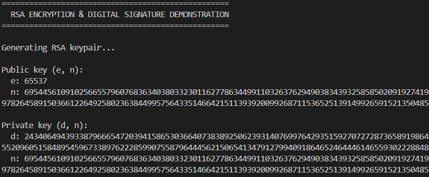
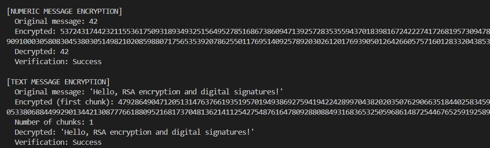
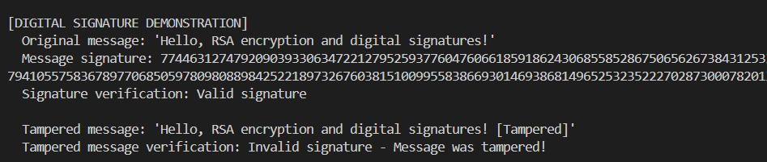

# 🔐 RSA Algorithm Implementation 

---

## 📄 Student Details

- **Name:** Aditya Kumar Singh
- **Roll Number:** CS22B1001
 
## RSA-Report-Documentation
[RSA-Report](CS22B1001_RSA.pdf)
 
## Overview

This report documents the implementation of the RSA (Rivest–Shamir–Adleman) cryptographic algorithm in Python. RSA is one of the first practical public-key cryptosystems and is widely used for secure data transmission. The security of RSA is based on the practical difficulty of factoring the product of two large prime numbers.

## Table of Contents

- [Mathematical Background](#mathematical-background)
- [Implementation Details](#implementation-details)
  - [Key Generation](#key-generation)
  - [Encryption and Decryption](#encryption-and-decryption)
  - [String Handling](#string-handling)
  - [Digital Signatures](#digital-signatures)
- [Code Structure](#code-structure)
- [Usage Examples](#usage-examples)
- [Security Considerations](#security-considerations)
- [Limitations](#limitations)
- [Performance Analysis](#performance-analysis)
- [Implementation Output](#implementation-output)


## Mathematical Background

RSA is based on the following mathematical principles:

1. **Key Generation**:
   - Select two large prime numbers, p and q
   - Compute n = p × q
   - Compute Euler's totient function: φ(n) = (p-1) × (q-1)
   - Choose an integer e such that 1 < e < φ(n) and gcd(e, φ(n)) = 1
   - Compute d such that d × e ≡ 1 (mod φ(n))
   - Public key: (e, n)
   - Private key: (d, n)

2. **Encryption**:
   - For a message m, compute ciphertext c = m^e mod n

3. **Decryption**:
   - For a ciphertext c, compute message m = c^d mod n

4. **Digital Signatures**:
   - Hash the message to create a fixed-length representation
   - Sign the hash with the private key: signature = hash^d mod n
   - Verify by comparing hash with signature^e mod n

The security of RSA relies on the fact that while it's easy to find large prime numbers and multiply them together, it's computationally difficult to factor the product back into the original primes.

## Implementation Details

### Key Generation

The implementation uses the following steps to generate RSA keys:

1. **Prime Generation**: Uses a probabilistic primality test (Miller-Rabin) to generate two large prime numbers of specified bit length.
2. **Computing Totient**: Calculates φ(n) = (p-1) × (q-1)
3. **Selecting e**: Uses 65537 (2^16 + 1) as the default public exponent, which is a standard choice that provides good security while enabling efficient encryption.
4. **Computing d**: Calculates the modular multiplicative inverse of e mod φ(n) using the Extended Euclidean Algorithm.

### Encryption and Decryption

The core encryption and decryption operations are implemented using the `pow()` function in Python, which efficiently computes modular exponentiation:

- **Encryption**: `c = pow(m, e, n)`
- **Decryption**: `m = pow(c, d, n)`

### String Handling

To encrypt text messages, the implementation:

1. Converts strings to integers by treating the UTF-8 encoded bytes as a large integer
2. Breaks large messages into chunks that can fit within the RSA modulus
3. Encrypts each chunk separately
4. Combines the chunks for the final result

Decryption reverses this process to recover the original text.

### Digital Signatures

The digital signature implementation follows these steps:

1. **Hashing**: Uses SHA-256 to create a fixed-length hash of the message
2. **Signing**: Uses the private key to create a signature: signature = hash^d mod n
3. **Verification**: Uses the public key to verify: hash == signature^e mod n

This process ensures:
- **Authentication**: The message was sent by the claimed sender
- **Integrity**: The message hasn't been altered during transmission
- **Non-repudiation**: The sender cannot deny sending the message

## Code Structure

The implementation consists of the following key functions:

- `is_prime()`: Implements the Miller-Rabin primality test
- `generate_prime()`: Generates random prime numbers of specified bit length
- `extended_gcd()`: Implements the Extended Euclidean Algorithm
- `mod_inverse()`: Calculates modular multiplicative inverse
- `generate_keypair()`: Produces RSA public and private key pairs
- `encrypt()` and `decrypt()`: Core RSA operations on integers
- `string_to_int()` and `int_to_string()`: Conversion between strings and integers
- `encrypt_string()` and `decrypt_string()`: Handling encryption and decryption of text messages
- `hash_message()`: Creates a hash of a message
- `sign_message()`: Creates a digital signature for a message
- `verify_signature()`: Verifies the authenticity of a signed message
- `demonstrate_rsa()`: A demonstration function that shows all aspects of the algorithm in action

## Usage Examples

Here's a basic example demonstrating how to use the implementation:

```python
# Generate key pair
public_key, private_key = generate_keypair(bits=1024)

# Encrypt a message
message = "Hello, RSA!"
encrypted = encrypt_string(message, public_key)

# Decrypt the message
decrypted = decrypt_string(encrypted, private_key)
print(decrypted)  # Should output: "Hello, RSA!"

# Sign a message
signature = sign_message(message, private_key)

# Verify the signature
is_valid = verify_signature(message, signature, public_key)
print(f"Signature valid: {is_valid}")  # Should output: True

# Verify a tampered message
tampered = message + " [Tampered]"
is_valid = verify_signature(tampered, signature, public_key)
print(f"Tampered signature valid: {is_valid}")  # Should output: False
```

## Security Considerations

This implementation includes several security considerations:

1. **Key Size**: The default key size is 1024 bits, which provides reasonable security. For more sensitive applications, 2048 or 4096 bits should be used.
2. **Primality Testing**: Uses the Miller-Rabin test with multiple iterations to ensure the primality of generated numbers.
3. **Padding**: The implementation doesn't include padding schemes like PKCS#1, which are essential for secure real-world usage.
4. **Side-Channel Attacks**: The implementation doesn't include protections against timing attacks or other side-channel vulnerabilities.
5. **Hash Function**: Uses SHA-256 for message digests in digital signatures, providing good security against preimage and collision attacks.

## Limitations

The current implementation has several limitations:

1. **Performance**: Not optimized for large messages or high-throughput applications.
2. **Missing Padding**: Lacks cryptographic padding schemes that protect against certain attacks.
3. **Message Size**: Limited by the key size (messages must be smaller than the modulus).
4. **Validation**: Limited input validation and error handling.
5. **Signature Scheme**: Uses a basic RSA signature scheme without additional security measures like PSS (Probabilistic Signature Scheme).

## Performance Analysis

The most computationally intensive operations in this implementation are:

1. **Prime Generation**: Finding large primes for key generation
2. **Modular Exponentiation**: The core of encryption, decryption, and digital signatures
3. **Modular Inverse Calculation**: Part of the key generation process

For 1024-bit keys, key generation takes a few seconds on modern hardware. Encryption, decryption, and signature operations are relatively fast for small messages but scale linearly with message size.

## Implementation Output

Below are the results from running the demonstration script that showcases the RSA encryption, decryption, and digital signature verification processes:



The image above shows the RSA key generation process, displaying both the public key (e, n) and private key (d, n) components. The large values of n, e, and d demonstrate the security of RSA through large numbers.



This image demonstrates the encryption and decryption of both numeric and text messages. Note how the encrypted values are completely different from the original messages, and how the decryption process successfully recovers the original data.



This final image shows the digital signature process in action:
1. A signature is generated for the original message using the private key
2. The signature is successfully verified with the original message using the public key
3. When the message is tampered with (by adding "[Tampered]"), the verification fails, proving that digital signatures can detect any modifications to the original message

The demonstration output confirms that:
- Encryption successfully converts plaintext into unintelligible ciphertext
- Decryption correctly recovers the original message
- Digital signatures can verify the authenticity and integrity of messages
- Any tampering with signed messages is immediately detected

This visualization helps understand how RSA protects data integrity and authenticity through mathematical operations on large numbers.


